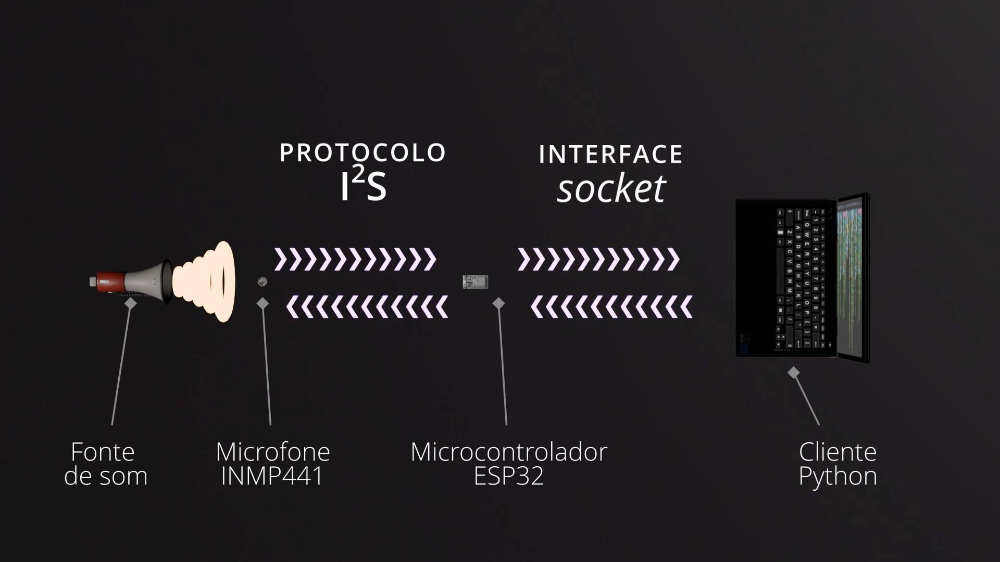
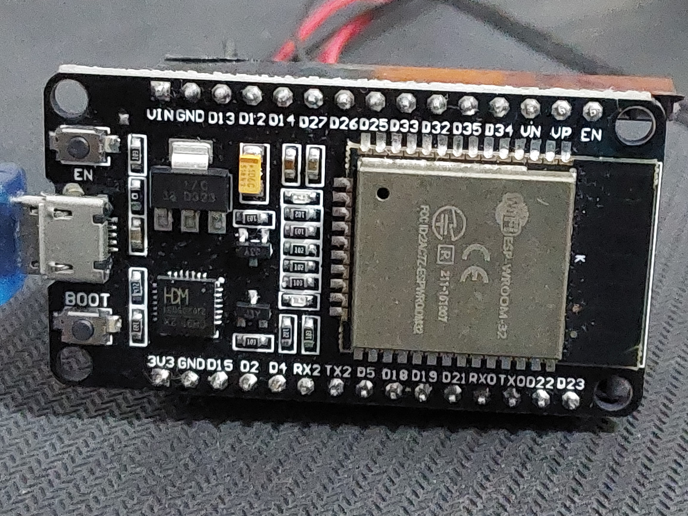
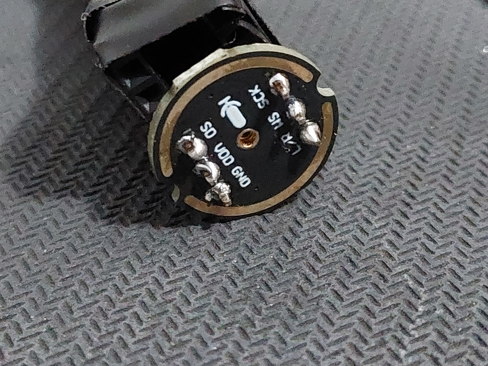
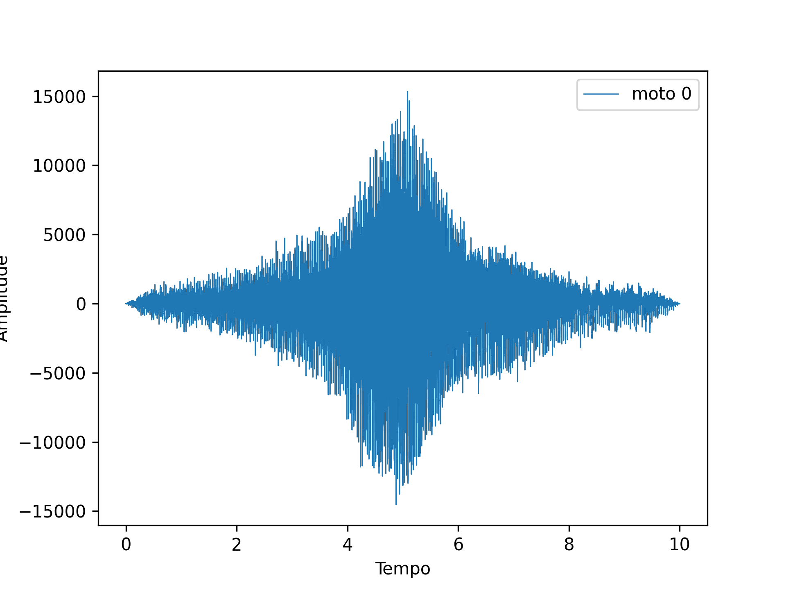
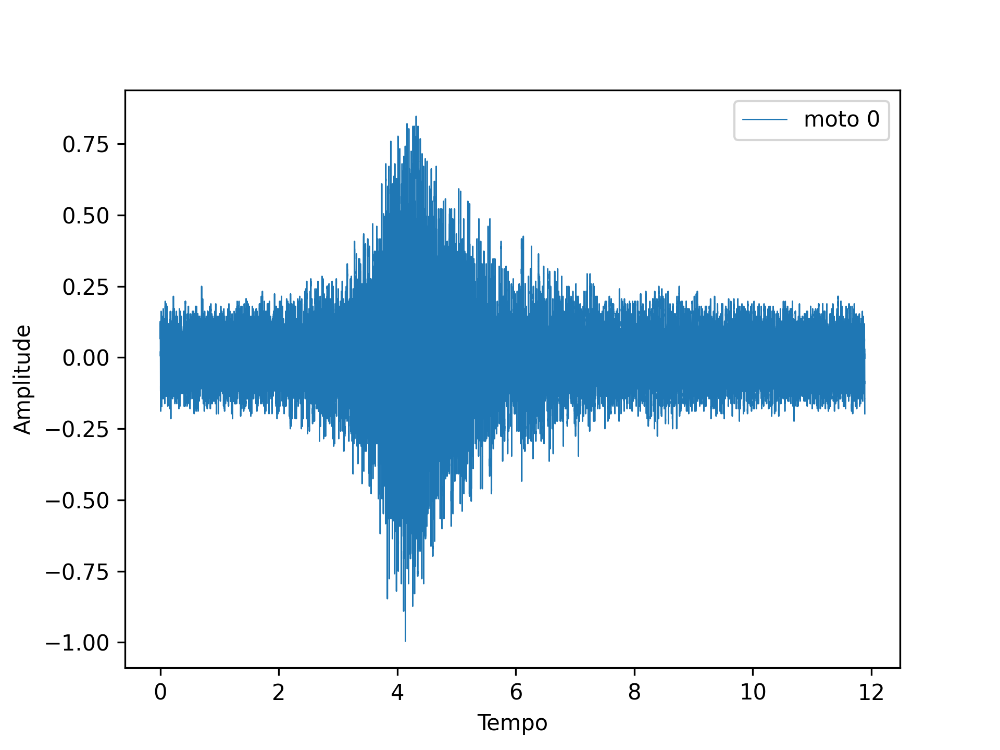
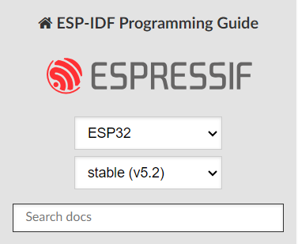
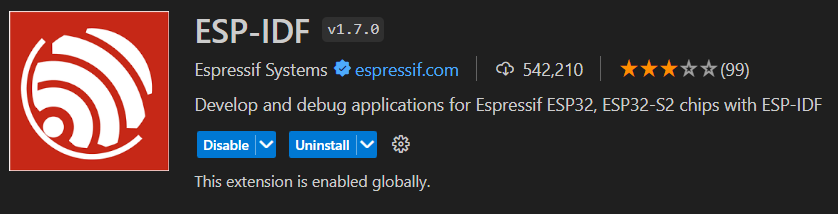
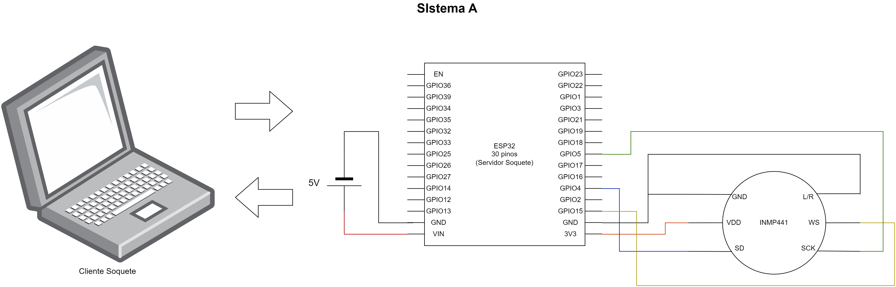

# SISTEMA A (TCC)

#### Sistema de processamento de áudio com transmissão de dados brutos via internet utilizando o microcontrolador ESP32, um microfone INMP441 e um cliente escrito em Python rodando no computador.

Este projeto foi encarado como um exercício de desenvolvimento tecnológico de baixo custo, utilizando ferramentas acessíveis e sem muitas camadas de abstração de _hardware_ criadas por outros desenvolvedores.

  

O sistema é capaz de amostrar áudio a $22,05KHz$, com resolução de 16 _bits_, apesar de carregar bastante ruído.

    
    

O código do microcontrolador foi escrito utilizando o _framework_ _ESP-IDF_ da _Espressif_, baseada no sistema operacional _FreeRTOS_. Este é um diferencial de muitos sistemas desse tipo que encontrei durante a pesquisa, que utilizavam _Arduino_ ou _Micropython_ e não serviam bem aos meus propósitos.

    
    

Também foi utilizada a extensão oficial da _Espressif_ para _VSCode_. Para utilizar os códigos deste projeto, basta iniciar um novo projeto a partir de um _template_ básico e copiar o código do `servidor_inmp441.c` para dentro do arquivo `main.c` e copiar o restante dos arquivos para a pasta principal.

A montagem do sistema deve ser realizada da seguinte forma:

Mais informações podem ser encontradas no relatório do meu TCC entre os arquivos do repositório.
